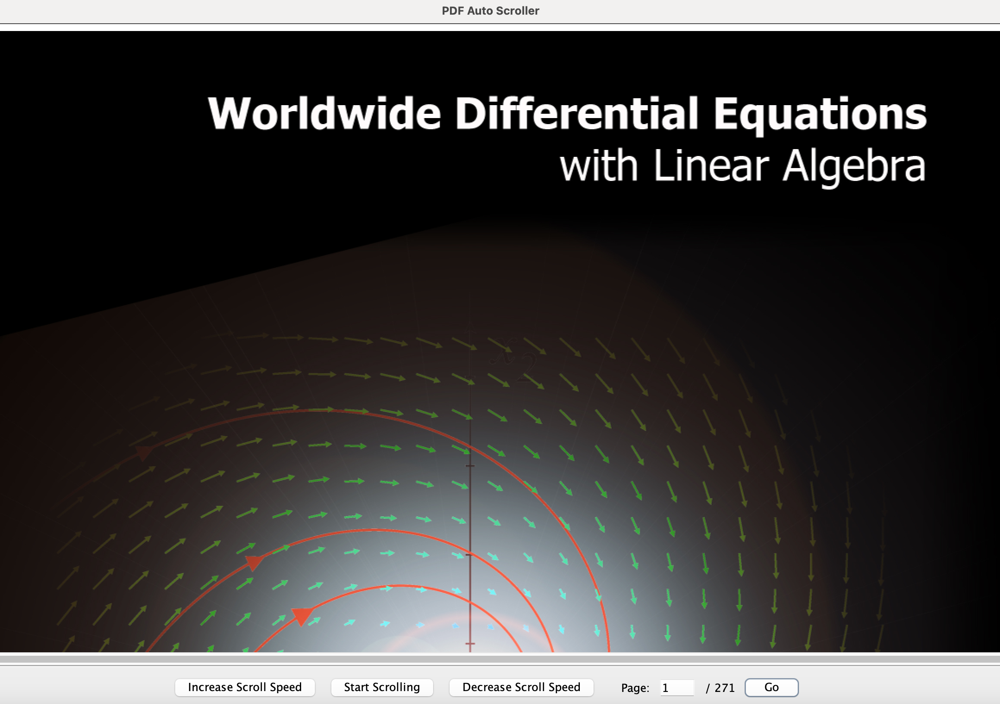

# LaidBackPDF

## Overview

LaidBackPDF is a PDF-focused application designed to provide a relaxed, user-friendly reading experience. Currently, it allows users to automatically scroll through PDFs with adjustable scroll speed, making it ideal for hands-free reading or study sessions. The project is being actively developed, with future features planned to enhance its utility for educational and interactive content.

## Features

- **Auto-Scrolling**: Automatically scroll through the PDF content at a customizable speed.
- **Speed Control**: Increase or decrease the scroll speed to suit your reading pace.
- **Section Navigation**: Detect and allow easy navigation between sections of a PDF (e.g., chapters in textbooks).

## Usage

1. **Open the Application**:
    - Run the `Main.java` class to start the LaidBackPDF application.

2. **Load a PDF**:
    - Upon launch, the application will prompt you to select a PDF file to load.

3. **Start Scrolling**:
    - Use the **Start Scrolling** button to begin auto-scrolling.
    - Adjust the scroll speed using the **Increase Scroll Speed** and **Decrease Scroll Speed** buttons.
    - To pause scrolling, click **Stop Scrolling**. You can resume scrolling by clicking **Start Scrolling** again.

###### Video demo coming soon
